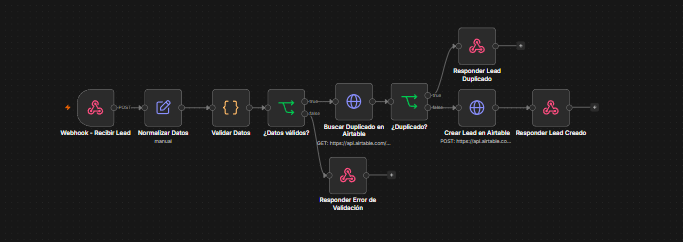
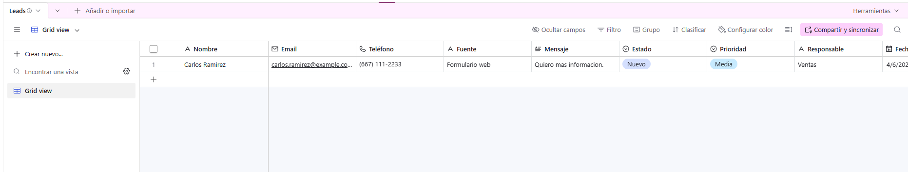
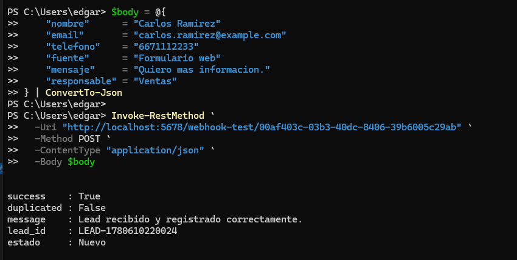
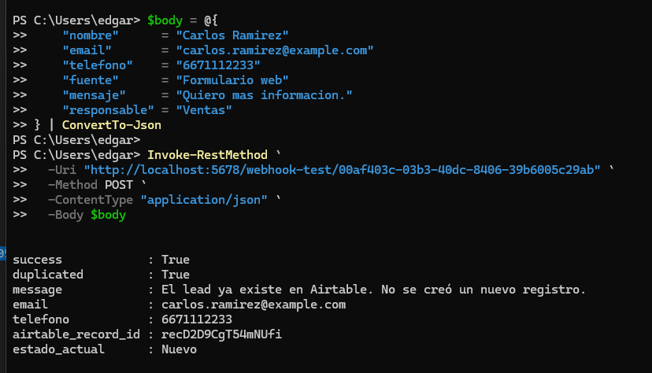
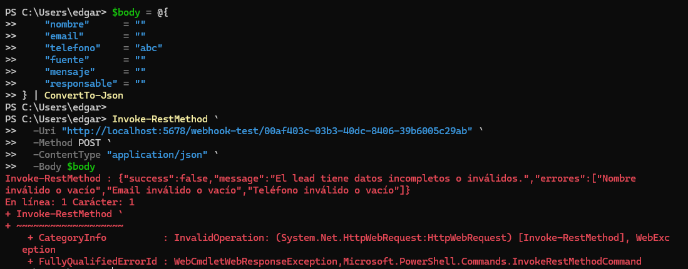

[English](./README.md) | [Español](./README.es.md)

# 01 - Captación de Leads con Detección de Duplicados

## Objetivo

Construir una automatización en n8n que reciba información de leads mediante un webhook, valide los datos de entrada, busque registros duplicados en Airtable y cree un nuevo lead solo cuando el contacto no exista previamente.

## Problema de negocio

El registro manual de leads puede generar duplicados, información incompleta y retrasos en el seguimiento. Este workflow ayuda a estandarizar el proceso de captación y asegura que cada lead sea validado antes de almacenarse.

## Solución

El workflow recibe datos de leads mediante un webhook POST. Normaliza la información, valida los campos requeridos, busca duplicados en Airtable por correo o teléfono y decide si debe crear un nuevo registro o responder que el lead ya existe.

## Herramientas utilizadas

- n8n
- Airtable
- Airtable REST API
- Webhook
- HTTP Request
- Nodo JavaScript Code
- JSON
- Métodos REST API
- Autenticación basada en token

## Lógica del workflow

```text
Webhook - Recibir Lead
↓
Normalizar Datos
↓
Validar Datos
↓
¿Datos válidos?
├── False → Responder Error de Validación
└── True  → Buscar Duplicado en Airtable
              ↓
           ¿Existe duplicado?
           ├── True  → Responder Lead Duplicado
           └── False → Crear Lead en Airtable
                         ↓
                      Responder Lead Creado
```

## Ejemplo de entrada

```json
{
  "nombre": "Carlos Ramirez",
  "email": "carlos.ramirez@example.com",
  "telefono": "6671112233",
  "fuente": "Formulario web",
  "mensaje": "Quiero mas informacion.",
  "responsable": "Ventas"
}
```

## Respuesta exitosa

```json
{
  "success": true,
  "duplicated": false,
  "message": "Lead recibido y registrado correctamente.",
  "lead_id": "LEAD-178061022002",
  "estado": "Nuevo"
}
```

## Respuesta por duplicado

```json
{
  "success": true,
  "duplicated": true,
  "message": "El lead ya existe en Airtable. No se creó un nuevo registro.",
  "email": "carlos.ramirez@example.com",
  "telefono": "6671112233",
  "airtable_record_id": "recXXXXXXXXXXXX",
  "estado_actual": "Nuevo"
}
```

## Respuesta por error de validación

```json
{
  "success": false,
  "message": "El lead tiene datos incompletos o inválidos.",
  "errores": [
    "Nombre inválido o vacío",
    "Email inválido o vacío",
    "Teléfono inválido o vacío"
  ]
}
```

## Capturas

### Workflow completo en n8n



### Lead creado en Airtable



### Respuesta exitosa para lead nuevo



### Respuesta para lead duplicado



### Respuesta por error de validación



## Valor de negocio

- Reduce la captura manual de datos.
- Evita registros duplicados.
- Valida información requerida antes de guardar.
- Estandariza el proceso de registro de leads.
- Mejora la confiabilidad del seguimiento.
- Devuelve respuestas API estructuradas.
- Facilita la auditoría y mantenimiento del proceso.

## Nota de seguridad

El workflow exportado no debe incluir tokens reales, API keys ni credenciales privadas.

Antes de publicarlo, reemplaza las credenciales por placeholders como:

```text
Bearer AIRTABLE_TOKEN_HERE
```
