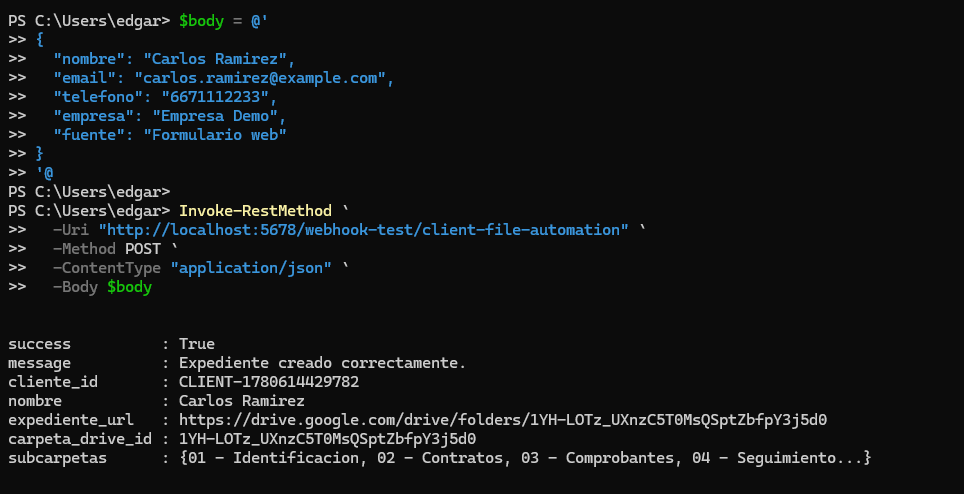
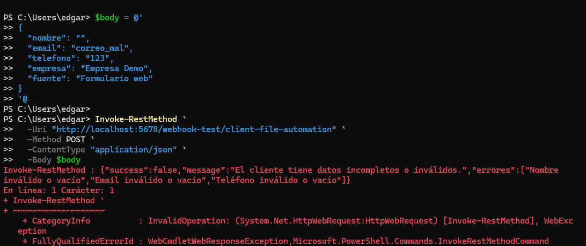
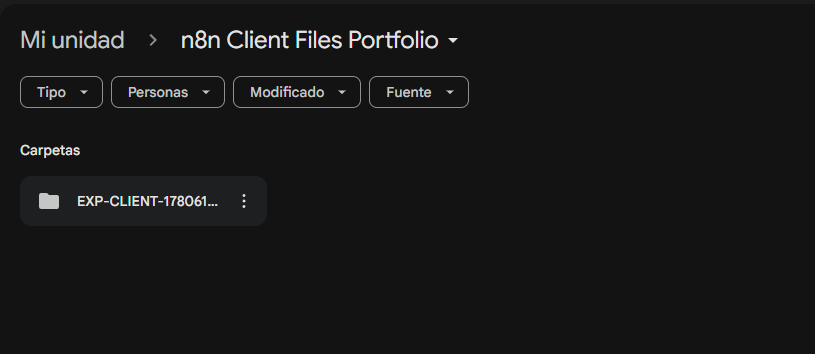
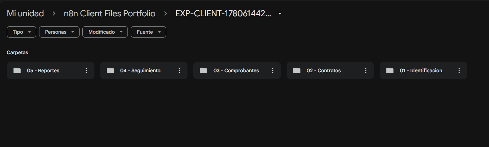
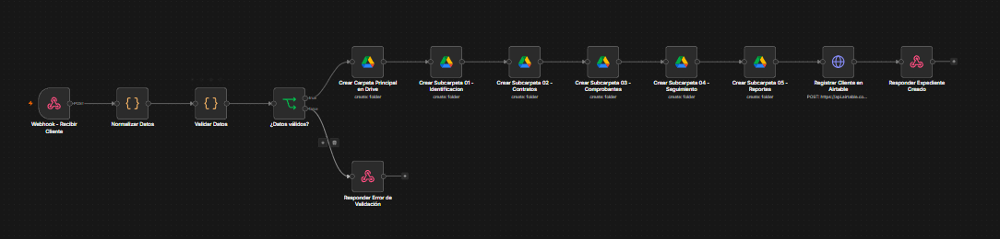

# 02 - Automatización de Expedientes de Clientes con Google Drive

## Objetivo

Construir una automatización en n8n que reciba información de clientes mediante un webhook, valide los datos de entrada, cree un expediente estructurado en Google Drive, registre el cliente en Airtable y devuelva la URL de la carpeta generada.

## Problema de negocio

La creación manual de expedientes puede provocar nombres de carpetas inconsistentes, subcarpetas faltantes, trabajo administrativo repetitivo y dificultad para dar seguimiento a la documentación de clientes. Este workflow estandariza la creación de expedientes y mejora la organización documental.

## Solución

El workflow recibe datos de clientes mediante un webhook POST. Normaliza y valida la información, crea una carpeta principal en Google Drive, genera subcarpetas predefinidas y guarda el registro del cliente en Airtable junto con la URL del expediente.

## Herramientas utilizadas

- n8n
- Google Drive
- Airtable
- Airtable REST API
- Webhook
- HTTP Request
- Nodo JavaScript Code
- JSON
- Autenticación basada en token
- Credenciales Google OAuth2

## Lógica del workflow

```text
Webhook - Recibir Cliente
↓
Normalizar Datos
↓
Validar Datos
↓
¿Datos válidos?
├── False → Responder Error de Validación
└── True  → Crear Carpeta Principal en Google Drive
              ↓
           Crear Subcarpeta 01 - Identificacion
              ↓
           Crear Subcarpeta 02 - Contratos
              ↓
           Crear Subcarpeta 03 - Comprobantes
              ↓
           Crear Subcarpeta 04 - Seguimiento
              ↓
           Crear Subcarpeta 05 - Reportes
              ↓
           Registrar Cliente en Airtable
              ↓
           Responder Expediente Creado
```

## Ejemplo de entrada

```json
{
  "nombre": "Carlos Ramirez",
  "email": "carlos.ramirez@example.com",
  "telefono": "6671112233",
  "empresa": "Empresa Demo",
  "fuente": "Formulario web"
}
```

## Respuesta exitosa

```json
{
  "success": true,
  "message": "Expediente creado correctamente.",
  "cliente_id": "CLIENT-1780614429782",
  "nombre": "Carlos Ramirez",
  "expediente_url": "https://drive.google.com/drive/folders/DRIVE_FOLDER_ID",
  "carpeta_drive_id": "DRIVE_FOLDER_ID",
  "subcarpetas": [
    "01 - Identificacion",
    "02 - Contratos",
    "03 - Comprobantes",
    "04 - Seguimiento",
    "05 - Reportes"
  ]
}
```

## Respuesta por error de validación

```json
{
  "success": false,
  "message": "El cliente tiene datos incompletos o inválidos.",
  "errores": [
    "Nombre inválido o vacío",
    "Email inválido o vacío",
    "Teléfono inválido o vacío"
  ]
}
```

## Estructura generada en Google Drive

```text
n8n Client Files Portfolio/
└── EXP-CLIENT-1780614429782 - Carlos Ramirez/
    ├── 01 - Identificacion/
    ├── 02 - Contratos/
    ├── 03 - Comprobantes/
    ├── 04 - Seguimiento/
    └── 05 - Reportes/
```

## Capturas

### Respuesta exitosa



### Respuesta por error de validación



### Carpeta principal en Google Drive



### Subcarpetas en Google Drive



### Workflow completo en n8n



## Valor de negocio

- Reduce la creación manual de carpetas.
- Estandariza la estructura de expedientes.
- Mejora la organización documental.
- Crea un registro rastreable en Airtable.
- Reduce errores administrativos.
- Devuelve una respuesta API estructurada con la URL de Drive.
- Facilita la auditoría y mantenimiento del proceso.

## Nota de seguridad

El workflow exportado no debe incluir tokens reales, credenciales de Google ni identificadores privados.

Antes de publicarlo, reemplaza las credenciales por placeholders como:

```text
Bearer AIRTABLE_TOKEN_HERE
PARENT_FOLDER_ID_HERE
GOOGLE_DRIVE_CREDENTIAL_PLACEHOLDER
```
