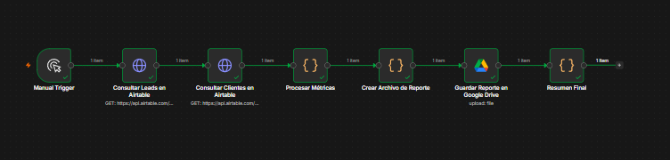
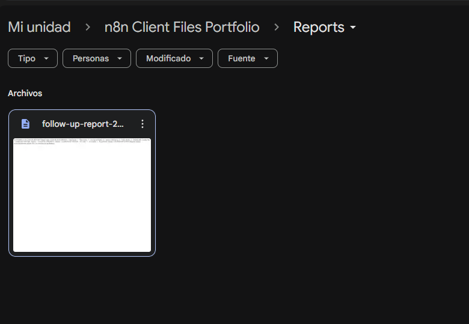
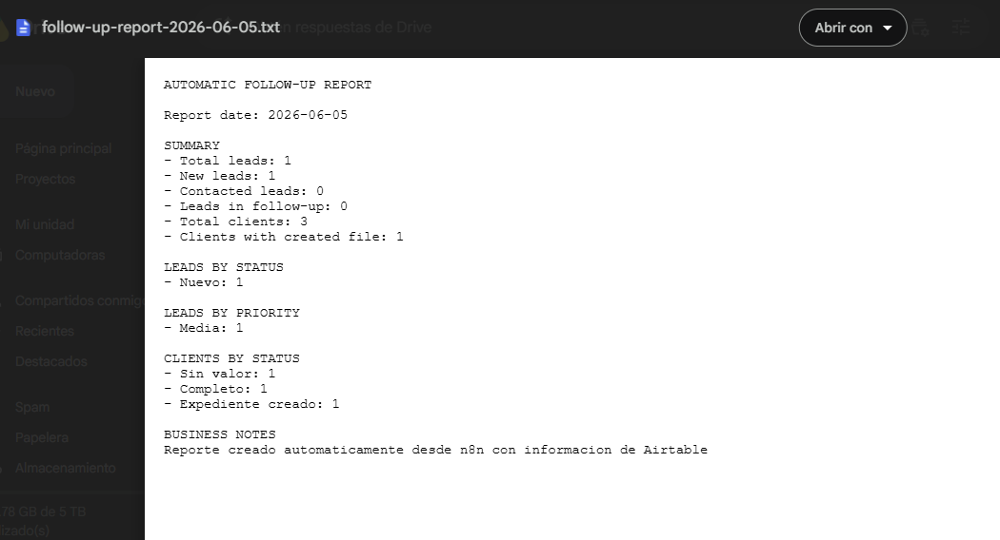
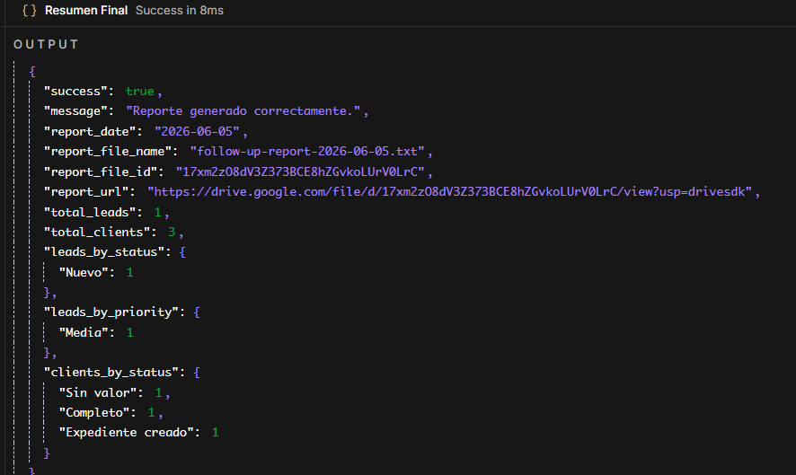

[English](./README.md) | [Español](./README.es.md)

# 03 - Automatic Follow-Up Report

## Objective

Build an n8n automation that generates an automatic follow-up report using data from Airtable, calculates business metrics and saves the report as a text file in Google Drive.

## Business Problem

Manual reporting can take time, introduce errors and make it difficult to track lead and client activity consistently. This workflow automates the reporting process by collecting data from Airtable, processing metrics and saving a structured report in Google Drive.

## Solution

The workflow runs manually or on a schedule, retrieves lead and client records from Airtable, calculates summary metrics, generates a text report, uploads the report to Google Drive and returns a structured JSON summary.

## Tools Used

- n8n
- Airtable
- Airtable REST API
- Google Drive
- HTTP Request nodes
- JavaScript Code node
- JSON
- Binary file generation
- Google OAuth2 credentials

## Workflow Logic

```text
Manual Trigger
↓
Get Leads from Airtable
↓
Get Clients from Airtable
↓
Process Metrics
↓
Create Report File
↓
Upload Report to Google Drive
↓
Return Final Summary
```

## Metrics Generated

- Total leads
- New leads
- Contacted leads
- Leads in follow-up
- Total clients
- Clients with created file
- Leads by status
- Leads by priority
- Clients by status

## Report Output Example

```text
AUTOMATIC FOLLOW-UP REPORT

Report date: 2026-06-05

SUMMARY
- Total leads: 1
- New leads: 1
- Contacted leads: 0
- Leads in follow-up: 0
- Total clients: 3
- Clients with created file: 1

LEADS BY STATUS
- Nuevo: 1

LEADS BY PRIORITY
- Media: 1

CLIENTS BY STATUS
- Sin valor: 1
- Completo: 1
- Expediente creado: 1

BUSINESS NOTES
Reporte creado automaticamente desde n8n con informacion de Airtable
```

## Final JSON Response Example

```json
{
  "success": true,
  "message": "Reporte generado correctamente.",
  "report_date": "2026-06-05",
  "report_file_name": "follow-up-report-2026-06-05.txt",
  "report_file_id": "DRIVE_FILE_ID",
  "report_url": "https://drive.google.com/file/d/DRIVE_FILE_ID/view",
  "total_leads": 1,
  "total_clients": 3,
  "leads_by_status": {
    "Nuevo": 1
  },
  "leads_by_priority": {
    "Media": 1
  },
  "clients_by_status": {
    "Sin valor": 1,
    "Completo": 1,
    "Expediente creado": 1
  }
}
```

## Screenshots

### Complete n8n workflow



### Google Drive report file



### Report file content



### Final summary output



## Business Value

- Reduces manual reporting work.
- Centralizes follow-up information.
- Creates consistent business metrics.
- Saves reports automatically in Google Drive.
- Provides a structured summary for review.
- Makes reporting easier to audit and repeat.
- Can be adapted to run daily, weekly or monthly.

## Security Note

The exported workflow must not include real API tokens, Google credentials, folder IDs or private identifiers.

Before publishing the workflow, replace credentials and private IDs with placeholders such as:

```text
Bearer AIRTABLE_TOKEN_HERE
REPORTS_FOLDER_ID_HERE
GOOGLE_DRIVE_CREDENTIAL_PLACEHOLDER
```

Never commit real credentials to a public repository.
