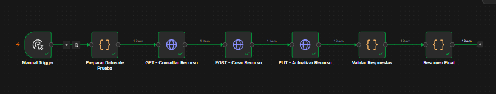
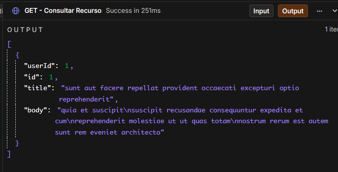
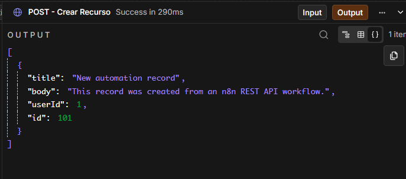
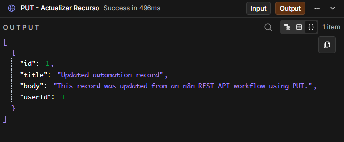
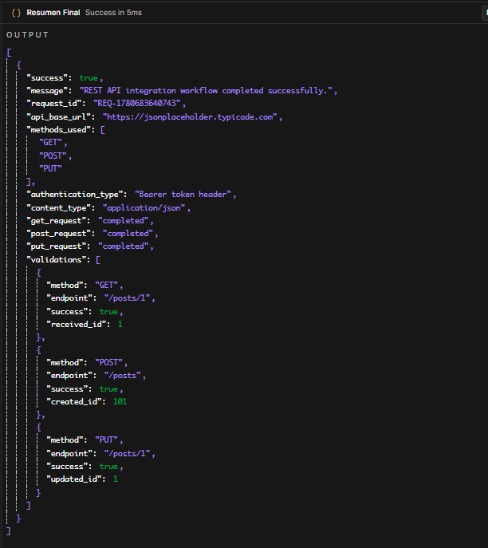

# 04 - REST API Integration Workflow

## Objective

Build an n8n workflow that demonstrates REST API integration using GET, POST and PUT requests, JSON payloads, headers, token-based authentication and response validation.

## Business Problem

Many business automation processes require connecting external systems through REST APIs. These integrations often need authenticated requests, structured JSON payloads, response validation and clear documentation for maintenance.

## Solution

This workflow simulates a REST API integration using a public test API. It performs a GET request to retrieve data, a POST request to create a new resource, a PUT request to update an existing resource and then validates the responses.

## Tools Used

- n8n
- HTTP Request nodes
- JavaScript Code node
- REST API methods
- GET request
- POST request
- PUT request
- JSON payloads
- Bearer token header
- Response validation

## Workflow Logic

```text
Manual Trigger
↓
Prepare Test Data
↓
GET - Retrieve Resource
↓
POST - Create Resource
↓
PUT - Update Resource
↓
Validate Responses
↓
Return Final Summary
```

## API Methods Demonstrated

| Method | Purpose | Endpoint |
|---|---|---|
| GET | Retrieve an existing resource | /posts/1 |
| POST | Create a new resource | /posts |
| PUT | Update an existing resource | /posts/1 |

## Authentication Example

The workflow includes an example Bearer token header:

```text
Authorization: Bearer DEMO_API_TOKEN
```

This token is only a placeholder used to demonstrate how authenticated requests are structured.

## POST Payload Example

```json
{
  "title": "New automation record",
  "body": "This record was created from an n8n REST API workflow.",
  "userId": 1
}
```

## PUT Payload Example

```json
{
  "id": 1,
  "title": "Updated automation record",
  "body": "This record was updated from an n8n REST API workflow using PUT.",
  "userId": 1
}
```

## Final JSON Response Example

```json
{
  "success": true,
  "message": "REST API integration workflow completed successfully.",
  "request_id": "REQ-1234567890",
  "api_base_url": "https://jsonplaceholder.typicode.com",
  "methods_used": ["GET", "POST", "PUT"],
  "authentication_type": "Bearer token header",
  "content_type": "application/json",
  "get_request": "completed",
  "post_request": "completed",
  "put_request": "completed"
}
```

## Screenshots

### Complete n8n workflow



### GET request output



### POST request output



### PUT request output



### Final summary output



## Business Value

- Demonstrates REST API integration skills.
- Shows use of GET, POST and PUT methods.
- Uses structured JSON payloads.
- Demonstrates token-based authentication headers.
- Validates API responses.
- Provides a reusable structure for connecting external systems.
- Helps document API behavior for maintenance.

## Security Note

This workflow uses a demo token placeholder.

Before publishing any workflow, replace real credentials with placeholders such as:

```text
Bearer DEMO_API_TOKEN
API_TOKEN_HERE
```

Never commit real API keys, access tokens or private credentials to a public repository.
