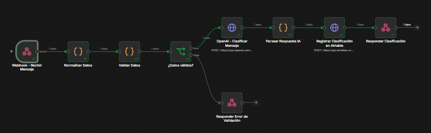
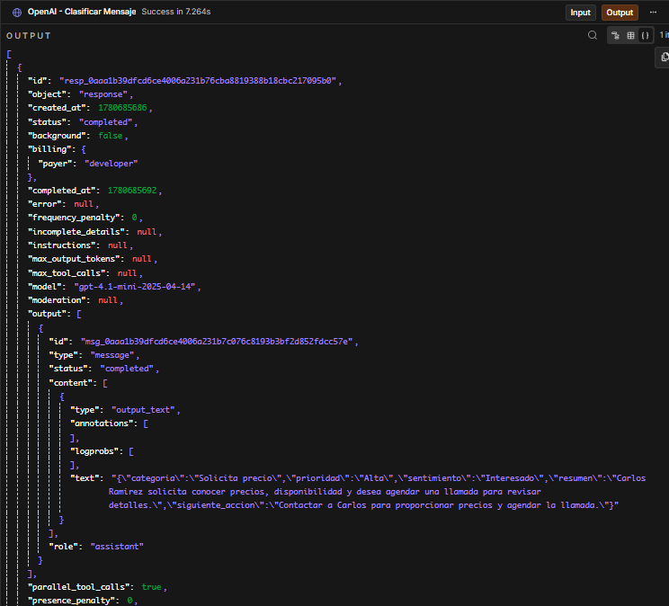
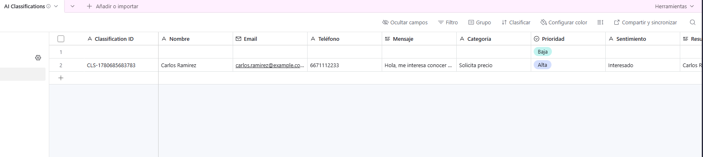
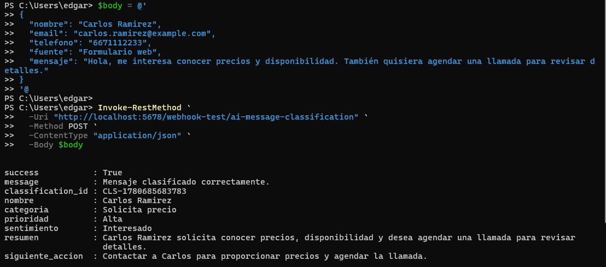
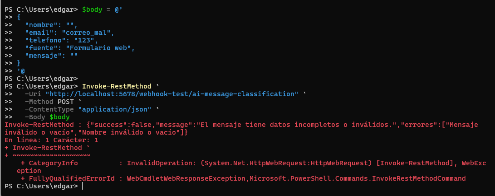

# 05 - AI Message Classification Workflow

## Objective

Build an n8n automation that receives a prospect message through a webhook, validates the input data, sends the message to OpenAI for classification, stores the result in Airtable and returns a structured JSON response.

## Business Problem

Sales and customer service teams often receive unstructured messages from prospects. Manually reviewing each message can delay follow-up and make it harder to prioritize opportunities. This workflow uses AI to classify messages, assign priority and suggest the next action.

## Solution

The workflow receives a prospect message using a POST webhook. It normalizes and validates the input, sends the message to OpenAI using the API, parses the AI response, stores the classification in Airtable and returns a structured response with category, priority, sentiment, summary and suggested next action.

## Tools Used

- n8n
- OpenAI API
- Airtable
- Airtable REST API
- Webhook
- HTTP Request nodes
- JavaScript Code node
- JSON
- Prompt engineering
- Structured AI output
- Token-based authentication

## Workflow Logic

```text
Webhook - Receive Message
↓
Normalize Data
↓
Validate Data
↓
Is Data Valid?
├── False → Return Validation Error
└── True  → Classify Message with OpenAI
              ↓
           Parse AI Response
              ↓
           Register Classification in Airtable
              ↓
           Return Classification Response
```

## Input Example

```json
{
  "nombre": "Carlos Ramirez",
  "email": "carlos.ramirez@example.com",
  "telefono": "6671112233",
  "fuente": "Formulario web",
  "mensaje": "Hola, me interesa conocer precios y disponibilidad. También quisiera agendar una llamada para revisar detalles."
}
```

## Successful Response

```json
{
  "success": true,
  "message": "Mensaje clasificado correctamente.",
  "classification_id": "CLS-1780685683783",
  "nombre": "Carlos Ramirez",
  "categoria": "Solicita precio",
  "prioridad": "Alta",
  "sentimiento": "Interesado",
  "resumen": "Carlos Ramirez solicita conocer precios, disponibilidad y desea agendar una llamada para revisar detalles.",
  "siguiente_accion": "Contactar a Carlos para proporcionar precios y agendar la llamada."
}
```

## Validation Error Response

```json
{
  "success": false,
  "message": "El mensaje tiene datos incompletos o inválidos.",
  "errores": [
    "Mensaje inválido o vacío",
    "Nombre inválido o vacío"
  ]
}
```

## AI Classification Fields

| Field | Description |
|---|---|
| categoria | Main intent detected in the prospect message |
| prioridad | Priority assigned based on urgency and business value |
| sentimiento | General sentiment of the message |
| resumen | Short summary of the prospect request |
| siguiente_accion | Suggested next action for the team |

## Example Classification

```json
{
  "categoria": "Solicita precio",
  "prioridad": "Alta",
  "sentimiento": "Interesado",
  "resumen": "Carlos Ramirez solicita conocer precios, disponibilidad y desea agendar una llamada para revisar detalles.",
  "siguiente_accion": "Contactar a Carlos para proporcionar precios y agendar la llamada."
}
```

## Screenshots

### Complete n8n workflow



### OpenAI classification output



### Airtable classification record



### Successful response



### Validation error response



## Business Value

- Reduces manual message review.
- Helps prioritize prospects automatically.
- Converts unstructured messages into structured data.
- Provides a suggested next action for follow-up.
- Stores AI classification results in Airtable.
- Improves response speed for sales or support teams.
- Demonstrates practical AI usage inside a business workflow.

## Security Note

The exported workflow must not include real API tokens, OpenAI API keys, Airtable personal access tokens or private credentials.

Before publishing the workflow, replace credentials with placeholders such as:

```text
Bearer OPENAI_API_KEY_HERE
Bearer AIRTABLE_TOKEN_HERE
```

Never commit real credentials to a public repository.
