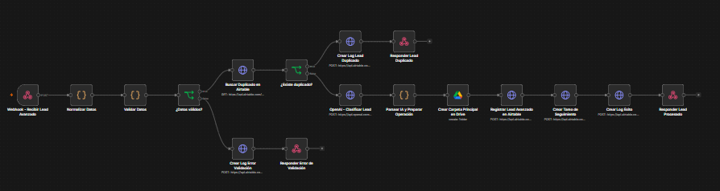
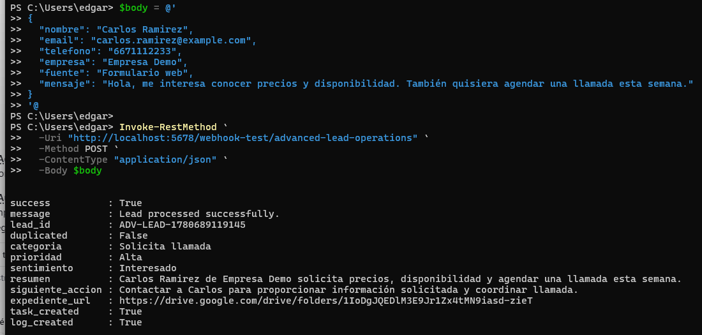
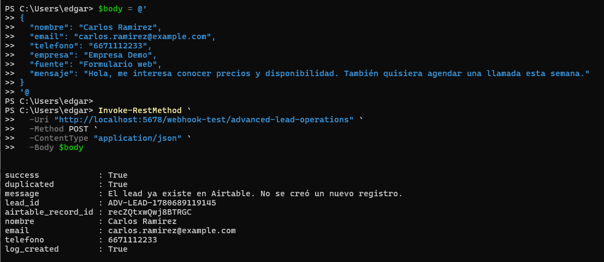
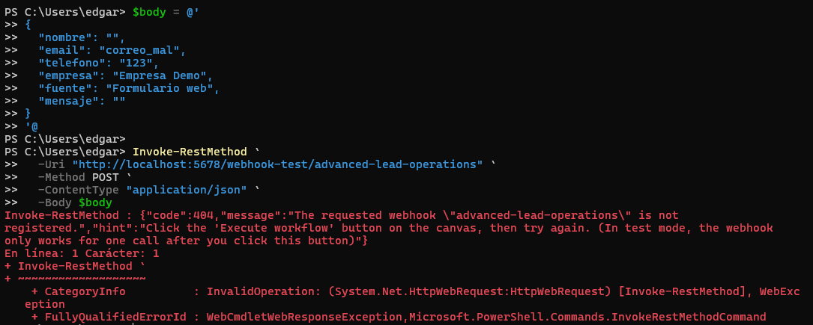
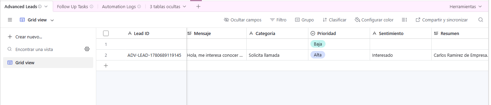
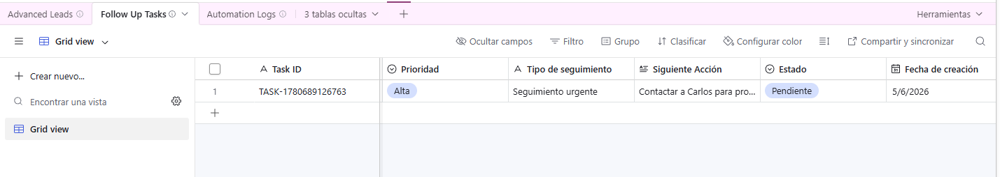
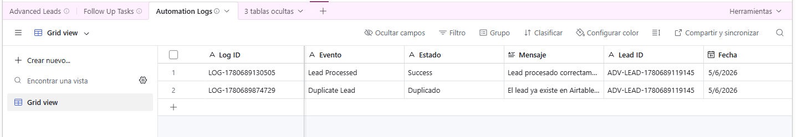
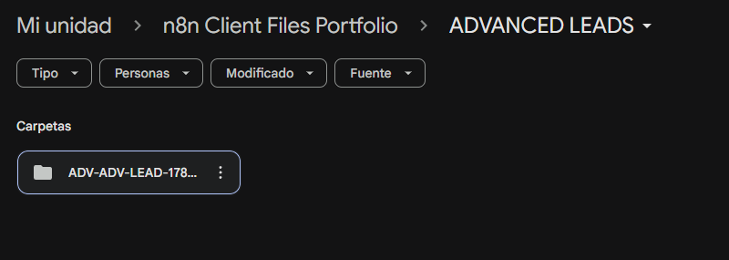

[English](./README.md) | [Español](./README.es.md)

# 06 - Workflow Avanzado de Operaciones de Leads

## Objetivo

Construir una automatización avanzada en n8n que reciba un lead de ventas, valide los datos de entrada, detecte duplicados en Airtable, clasifique el mensaje con OpenAI, cree una carpeta en Google Drive, registre el lead, cree una tarea de seguimiento, almacene logs de automatización y devuelva una respuesta JSON estructurada.

## Problema de negocio

Los equipos de ventas y operaciones suelen gestionar leads manualmente en varias herramientas. Esto puede provocar registros duplicados, retrasos en el seguimiento, documentación faltante, priorización inconsistente y poca trazabilidad. Este workflow combina múltiples pasos de automatización en un proceso completo para mejorar el manejo de leads y la visibilidad operativa.

## Solución

El workflow recibe datos de leads mediante un webhook. Normaliza y valida la información, busca duplicados en Airtable, clasifica el mensaje usando OpenAI, crea una carpeta en Google Drive para el lead, registra el lead en Airtable, crea una tarea de seguimiento, guarda un log de automatización y devuelve una respuesta completa.

## Herramientas utilizadas

- n8n
- Airtable
- Airtable REST API
- Google Drive
- OpenAI API
- Webhook
- Nodos HTTP Request
- Nodo JavaScript Code
- JSON
- Google OAuth2
- Autenticación basada en token
- Prompt engineering
- Clasificación con IA

## Lógica del workflow

```text
Webhook - Recibir Lead Avanzado
↓
Normalizar Datos
↓
Validar Datos
↓
¿Datos válidos?
├── False → Crear Log Error Validación
│            ↓
│         Responder Error de Validación
│
└── True  → Buscar Duplicado en Airtable
              ↓
           ¿Existe duplicado?
           ├── True → Crear Log Lead Duplicado
           │          ↓
           │       Responder Lead Duplicado
           │
           └── False → Clasificar Lead con OpenAI
                         ↓
                      Parsear IA y Preparar Operación
                         ↓
                      Crear Carpeta en Google Drive
                         ↓
                      Registrar Lead Avanzado en Airtable
                         ↓
                      Crear Tarea de Seguimiento
                         ↓
                      Crear Log Éxito
                         ↓
                      Responder Lead Procesado
```

## Tablas de Airtable utilizadas

### Advanced Leads

Guarda el lead procesado y el resultado de clasificación de IA.

Campos principales:

- Lead ID
- Nombre
- Email
- Teléfono
- Empresa
- Fuente
- Mensaje
- Categoría
- Prioridad
- Sentimiento
- Resumen
- Siguiente Acción
- Estado
- Expediente URL
- Carpeta Drive ID
- Fecha de registro
- JSON Original
- AI Raw Response

### Follow Up Tasks

Guarda la tarea de seguimiento creada según la prioridad asignada por IA.

Campos principales:

- Task ID
- Lead ID
- Nombre
- Email
- Teléfono
- Prioridad
- Tipo de seguimiento
- Siguiente Acción
- Estado
- Fecha de creación
- Fecha sugerida de contacto

### Automation Logs

Guarda eventos del workflow para trazabilidad y auditoría.

Campos principales:

- Log ID
- Workflow
- Evento
- Estado
- Mensaje
- Lead ID
- Fecha
- JSON

## Ejemplo de entrada

```json
{
  "nombre": "Carlos Ramirez",
  "email": "carlos.ramirez@example.com",
  "telefono": "6671112233",
  "empresa": "Empresa Demo",
  "fuente": "Formulario web",
  "mensaje": "Hola, me interesa conocer precios y disponibilidad. También quisiera agendar una llamada esta semana."
}
```

## Respuesta exitosa

```json
{
  "success": true,
  "message": "Lead processed successfully.",
  "lead_id": "ADV-LEAD-178069119145",
  "duplicated": false,
  "categoria": "Solicita llamada",
  "prioridad": "Alta",
  "sentimiento": "Interesado",
  "resumen": "Carlos Ramirez de Empresa Demo solicita precios, disponibilidad y agendar una llamada esta semana.",
  "siguiente_accion": "Contactar a Carlos para proporcionar información solicitada y coordinar llamada.",
  "expediente_url": "https://drive.google.com/drive/folders/DRIVE_FOLDER_ID",
  "task_created": true,
  "log_created": true
}
```

## Respuesta por duplicado

```json
{
  "success": true,
  "duplicated": true,
  "message": "El lead ya existe en Airtable. No se creó un nuevo registro.",
  "lead_id": "ADV-LEAD-178069119145",
  "airtable_record_id": "recXXXXXXXXXXXX",
  "nombre": "Carlos Ramirez",
  "email": "carlos.ramirez@example.com",
  "telefono": "6671112233",
  "log_created": true
}
```

## Respuesta por error de validación

```json
{
  "success": false,
  "message": "El lead tiene datos incompletos o inválidos.",
  "errores": [
    "Nombre inválido o vacío",
    "Email inválido o vacío",
    "Teléfono inválido o vacío",
    "Mensaje inválido o vacío"
  ],
  "log_created": true
}
```

## Capturas

### Workflow completo en n8n



### Respuesta exitosa



### Respuesta por duplicado



### Respuesta por error de validación



### Registro en Advanced Leads



### Registro de tarea de seguimiento



### Registro de log de automatización



### Carpeta en Google Drive



## Valor de negocio

- Reduce el procesamiento manual de leads.
- Evita registros duplicados.
- Utiliza IA para clasificar intención, prioridad y sentimiento.
- Crea carpetas estructuradas en Google Drive automáticamente.
- Registra leads en Airtable con contexto completo.
- Crea tareas de seguimiento según la prioridad.
- Guarda logs de automatización para auditoría.
- Proporciona una estructura reutilizable tipo CRM.
- Combina validación, IA, almacenamiento, creación de tareas y logging en un solo workflow.

## Nota de seguridad

El workflow exportado no debe incluir tokens reales, API keys de OpenAI, tokens personales de Airtable, credenciales de Google, IDs de carpetas ni identificadores privados.

Antes de publicarlo, reemplaza credenciales e IDs privados por placeholders como:

```text
Bearer AIRTABLE_TOKEN_HERE
Bearer OPENAI_API_KEY_HERE
ADVANCED_LEADS_FOLDER_ID_HERE
GOOGLE_DRIVE_CREDENTIAL_PLACEHOLDER
```

Nunca publiques credenciales reales en un repositorio público.
