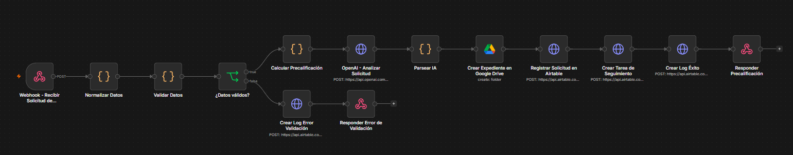
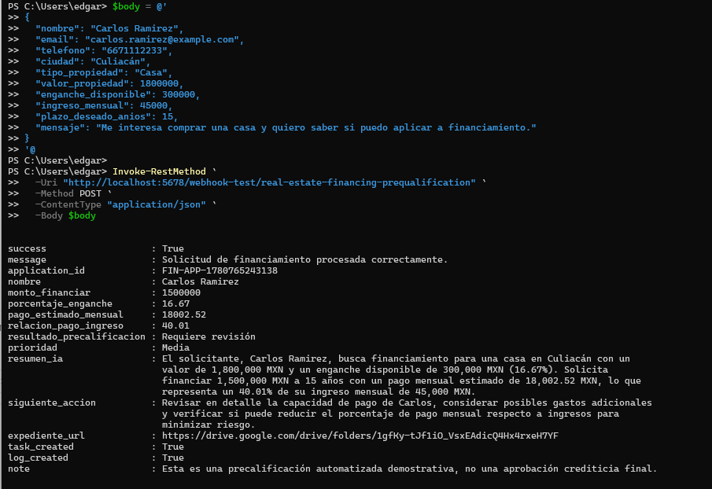
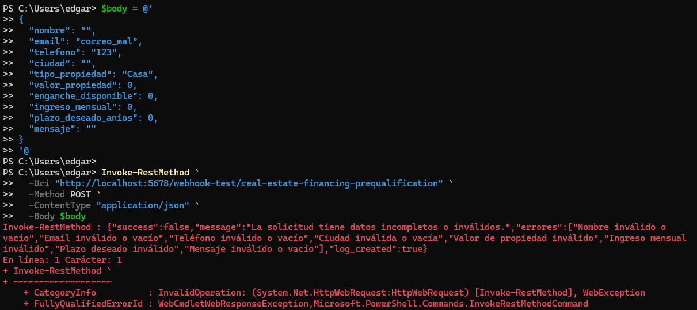
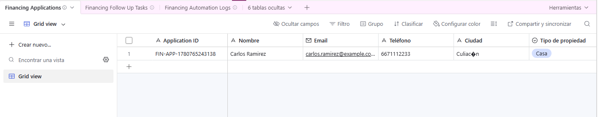
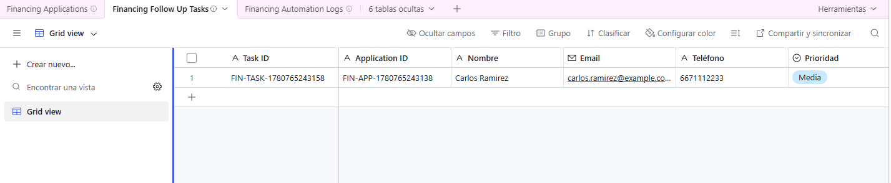
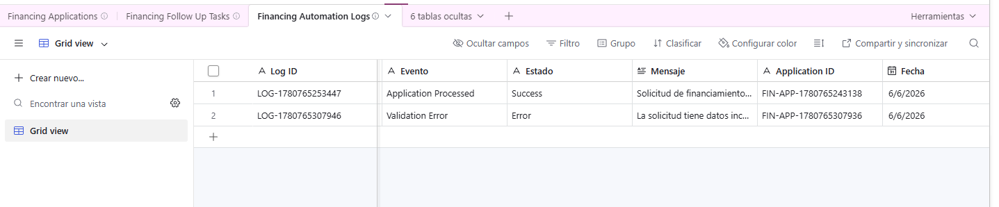
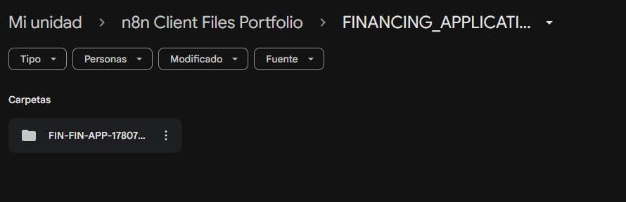

[English](./README.md) | [Español](./README.es.md)

# 07 - Workflow de Precalificación para Financiamiento Inmobiliario

## Objetivo

Construir una automatización en n8n para una financiera inmobiliaria que reciba solicitudes de financiamiento, valide los datos del prospecto, calcule una precalificación básica, clasifique el caso con OpenAI, cree un expediente en Google Drive, registre la solicitud en Airtable, cree una tarea de seguimiento, almacene logs de automatización y devuelva una respuesta JSON estructurada.

## Problema de negocio

Las financieras inmobiliarias suelen recibir solicitudes mediante formularios, mensajes o canales comerciales. Estas solicitudes requieren revisión manual, validación de datos básicos, análisis financiero inicial, organización de documentos, asignación de seguimiento y trazabilidad interna.

Sin automatización, este proceso puede volverse lento, inconsistente y difícil de auditar.

## Solución

Este workflow recibe una solicitud de financiamiento mediante un webhook, valida los datos requeridos, calcula métricas básicas de precalificación, utiliza OpenAI para resumir el caso y sugerir la siguiente acción, crea una carpeta en Google Drive para el prospecto, registra la solicitud en Airtable, crea una tarea de seguimiento y almacena un log de automatización.

## Herramientas utilizadas

- n8n
- Airtable
- Airtable REST API
- Google Drive
- OpenAI API
- Webhook
- Nodos HTTP Request
- Nodo JavaScript Code
- JSON
- Google OAuth2
- Autenticación basada en token
- Prompt engineering
- Análisis de solicitudes con IA

## Lógica del workflow

```text
Webhook - Recibir Solicitud de Financiamiento
↓
Normalizar Datos
↓
Validar Datos
↓
¿Datos válidos?
├── False → Crear Log de Error de Validación
│            ↓
│         Responder Error de Validación
│
└── True  → Calcular Precalificación Financiera
              ↓
           Clasificar Solicitud con OpenAI
              ↓
           Crear Expediente en Google Drive
              ↓
           Registrar Solicitud en Airtable
              ↓
           Crear Tarea de Seguimiento
              ↓
           Crear Log de Automatización
              ↓
           Responder Resultado de Precalificación
```

## Tablas de Airtable utilizadas

### Financing Applications

Guarda la solicitud de financiamiento, datos del prospecto, métricas financieras calculadas y análisis con IA.

Campos principales:

- Application ID
- Nombre
- Email
- Teléfono
- Ciudad
- Tipo de propiedad
- Valor propiedad
- Enganche disponible
- Porcentaje enganche
- Ingreso mensual
- Plazo deseado años
- Monto a financiar
- Pago estimado mensual
- Relación pago ingreso
- Resultado precalificación
- Prioridad
- Resumen IA
- Siguiente Acción
- Estado
- Expediente URL
- Carpeta Drive ID
- Fecha de registro
- JSON Original
- AI Raw Response

### Financing Follow Up Tasks

Guarda la tarea de seguimiento generada para la solicitud de financiamiento.

Campos principales:

- Task ID
- Application ID
- Nombre
- Email
- Teléfono
- Prioridad
- Resultado precalificación
- Siguiente Acción
- Estado
- Fecha de creación
- Fecha sugerida de contacto

### Financing Automation Logs

Guarda eventos del workflow para trazabilidad y auditoría.

Campos principales:

- Log ID
- Workflow
- Evento
- Estado
- Mensaje
- Application ID
- Fecha
- JSON

## Ejemplo de entrada

```json
{
  "nombre": "Carlos Ramirez",
  "email": "carlos.ramirez@example.com",
  "telefono": "6671112233",
  "ciudad": "Culiacan",
  "tipo_propiedad": "Casa",
  "valor_propiedad": 1800000,
  "enganche_disponible": 300000,
  "ingreso_mensual": 45000,
  "plazo_deseado_anios": 15,
  "mensaje": "Me interesa comprar una casa y quiero saber si puedo aplicar a financiamiento."
}
```

## Respuesta exitosa

```json
{
  "success": true,
  "message": "Solicitud de financiamiento procesada correctamente.",
  "application_id": "FIN-APP-1780765243138",
  "nombre": "Carlos Ramirez",
  "monto_financiar": 1500000,
  "porcentaje_enganche": 16.67,
  "pago_estimado_mensual": 18002.52,
  "relacion_pago_ingreso": 40.01,
  "resultado_precalificacion": "Requiere revisión",
  "prioridad": "Media",
  "resumen_ia": "El solicitante busca financiamiento para una casa en Culiacan con un valor de 1,800,000 MXN y un enganche disponible de 300,000 MXN.",
  "siguiente_accion": "Revisar en detalle la capacidad de pago del solicitante y validar documentación financiera.",
  "expediente_url": "https://drive.google.com/drive/folders/DRIVE_FOLDER_ID",
  "task_created": true,
  "log_created": true,
  "note": "Esta es una precalificación automatizada demostrativa, no una aprobación crediticia final."
}
```

## Respuesta por error de validación

```json
{
  "success": false,
  "message": "La solicitud tiene datos incompletos o inválidos.",
  "errores": [
    "Nombre inválido o vacío",
    "Email inválido o vacío",
    "Teléfono inválido o vacío",
    "Ciudad inválida o vacía",
    "Valor de propiedad inválido",
    "Ingreso mensual inválido",
    "Plazo deseado inválido",
    "Mensaje inválido o vacío"
  ],
  "log_created": true
}
```

## Capturas

### Workflow completo en n8n



### Respuesta exitosa



### Respuesta por error de validación



### Registro en Financing Applications



### Registro de tarea de seguimiento



### Registro de log de automatización



### Carpeta en Google Drive



## Valor de negocio

- Automatiza la recepción inicial de solicitudes de financiamiento inmobiliario.
- Valida datos del prospecto antes de crear registros.
- Calcula métricas básicas de precalificación.
- Estima monto a financiar, porcentaje de enganche y relación pago-ingreso.
- Usa IA para resumir el caso y sugerir la siguiente acción.
- Crea un expediente organizado en Google Drive.
- Registra la solicitud en Airtable.
- Crea una tarea de seguimiento para el equipo comercial o financiero.
- Guarda logs para trazabilidad y auditoría.
- Demuestra un workflow alineado con operaciones de una financiera inmobiliaria.

## Aviso

Este workflow realiza una precalificación automatizada básica con fines demostrativos. No representa una aprobación crediticia final, asesoría legal ni recomendación financiera.

## Nota de seguridad

El workflow exportado no debe incluir tokens reales, API keys de OpenAI, tokens personales de Airtable, credenciales de Google, IDs de carpetas ni identificadores privados.

Antes de publicarlo, reemplaza credenciales e IDs privados por placeholders como:

```text
Bearer AIRTABLE_TOKEN_HERE
Bearer OPENAI_API_KEY_HERE
AIRTABLE_BASE_ID_HERE
FINANCING_APPLICATIONS_FOLDER_ID_HERE
GOOGLE_DRIVE_CREDENTIAL_PLACEHOLDER
```

Nunca publiques credenciales reales en un repositorio público.
