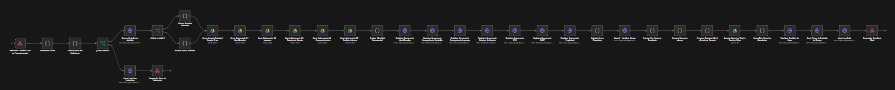
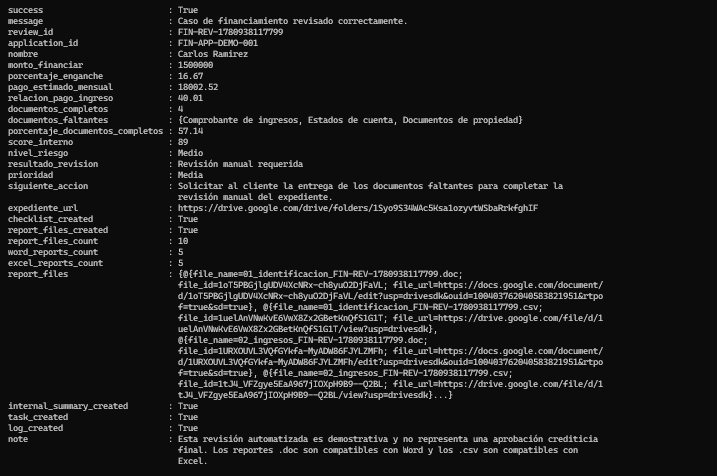
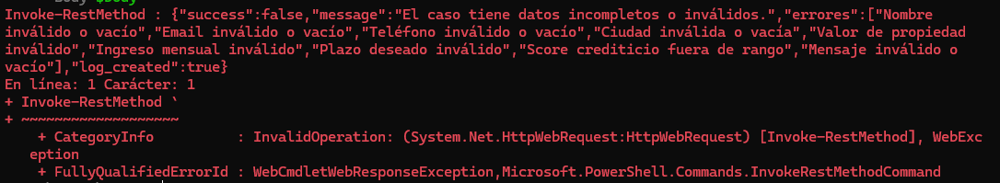
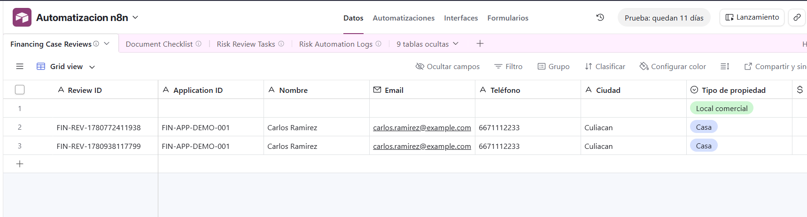
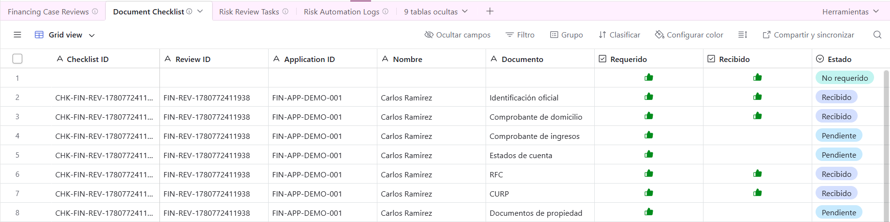
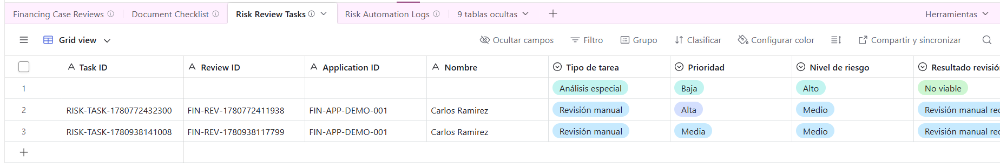
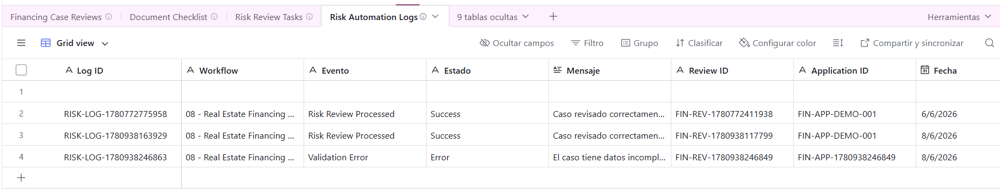
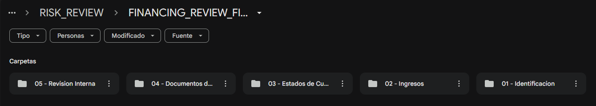
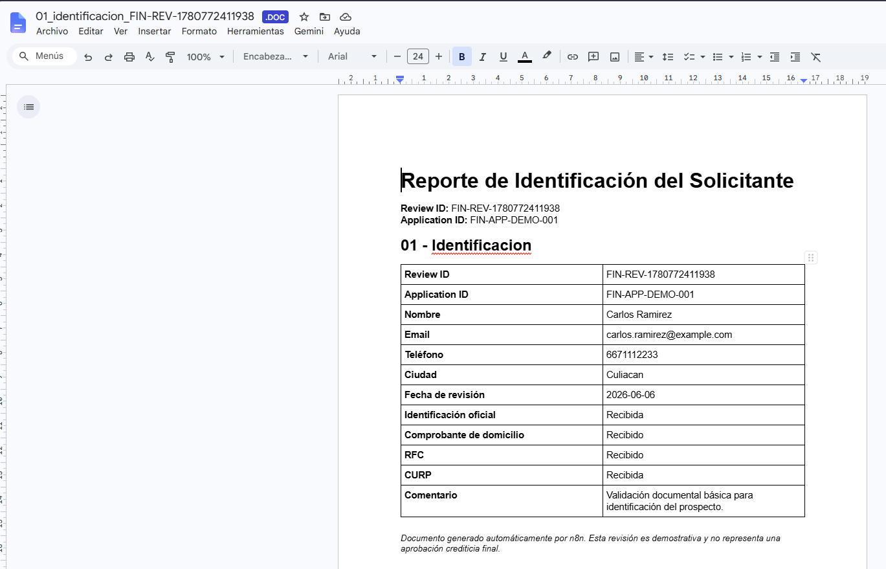
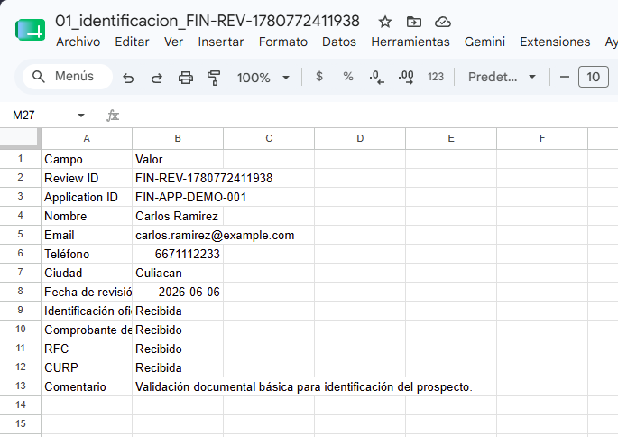

[English](./README.md) | [Español](./README.es.md)

# 08 - Workflow de Revisión Documental y Riesgo para Financiamiento Inmobiliario

## Objetivo

Construir una automatización avanzada en n8n para una financiera inmobiliaria que reciba un caso de financiamiento, valide los datos del solicitante, cree una estructura de carpetas en Google Drive, evalúe un checklist documental, calcule métricas financieras de riesgo, analice el caso con OpenAI, cree tareas de revisión, genere reportes compatibles con Word y Excel, almacene logs de automatización y devuelva una respuesta JSON estructurada.

## Problema de negocio

Las financieras inmobiliarias necesitan revisar información del solicitante, capacidad financiera, datos de la propiedad, documentación recibida y nivel de riesgo antes de continuar con un proceso de financiamiento.

Cuando este proceso se realiza manualmente, puede volverse lento, inconsistente y difícil de auditar. El equipo debe revisar documentos faltantes, calcular métricas básicas, asignar tareas de seguimiento, crear carpetas, generar reportes internos y mantener trazabilidad en varias herramientas.

## Solución

Este workflow recibe un caso de revisión de financiamiento mediante un webhook. Normaliza y valida la información, busca si ya existe una revisión en Airtable, crea una carpeta principal en Google Drive, genera subcarpetas por categoría documental, evalúa un checklist de documentos, registra cada documento en Airtable, calcula métricas financieras de riesgo, utiliza OpenAI para analizar el caso, genera reportes internos, registra la revisión en Airtable, crea una tarea de seguimiento, guarda logs de automatización y devuelve una respuesta completa.

## Herramientas utilizadas

* n8n
* Airtable
* Airtable REST API
* Google Drive
* OpenAI API
* Webhook
* Nodos HTTP Request
* Nodo JavaScript Code
* JSON
* Google OAuth2
* Autenticación basada en token
* Prompt engineering
* Análisis de riesgo con IA
* Automatización de checklist documental
* Generación de reportes compatibles con Word
* Generación de reportes compatibles con Excel
* Logs de automatización

## Lógica del workflow

```text
Webhook - Recibir Caso de Financiamiento
↓
Normalizar Datos
↓
Validar Datos del Solicitante
↓
¿Datos válidos?
├── False → Crear Log Error Validación
│            ↓
│         Responder Error de Validación
│
└── True  → Buscar Revisión en Airtable
              ↓
           ¿Existe revisión?
           ├── True  → Marcar Revisión Existente
           └── False → Marcar Nueva Revisión
              ↓
           Crear Carpeta Principal Google Drive
              ↓
           Crear Subcarpeta 01 - Identificacion
              ↓
           Crear Subcarpeta 02 - Ingresos
              ↓
           Crear Subcarpeta 03 - Estados de Cuenta
              ↓
           Crear Subcarpeta 04 - Documentos de Propiedad
              ↓
           Crear Subcarpeta 05 - Revision Interna
              ↓
           Evaluar Checklist Documental
              ↓
           Registrar Documentos del Checklist en Airtable
              ↓
           Calcular Score Financiero
              ↓
           Analizar Riesgo con OpenAI
              ↓
           Parsear Respuesta de IA
              ↓
           Generar Resumen Interno
              ↓
           Generar Reportes Compatibles con Word y Excel
              ↓
           Guardar Reportes en Google Drive
              ↓
           Registrar Revisión de Caso en Airtable
              ↓
           Crear Tarea de Revisión de Riesgo
              ↓
           Crear Log Éxito
              ↓
           Responder Resultado Final
```

## Tablas de Airtable utilizadas

### Financing Case Reviews

Guarda la revisión principal del caso, información del solicitante, métricas financieras, resumen documental, análisis con IA, reportes generados y estado final de revisión.

Campos principales:

* Review ID
* Application ID
* Nombre
* Email
* Teléfono
* Ciudad
* Tipo de propiedad
* Valor propiedad
* Enganche disponible
* Monto a financiar
* Porcentaje enganche
* Ingreso mensual
* Pago estimado mensual
* Relación pago ingreso
* Antigüedad laboral años
* Score crediticio
* Documentos completos
* Documentos faltantes
* Porcentaje documentos completos
* Score interno
* Nivel de riesgo
* Resultado revisión
* Prioridad
* Resumen IA
* Siguiente Acción
* Estado
* Expediente URL
* Carpeta Drive ID
* Reportes generados
* Reportes URL
* Fecha de revisión
* JSON Original
* AI Raw Response

### Document Checklist

Guarda cada documento requerido como un registro individual del checklist.

Campos principales:

* Checklist ID
* Review ID
* Application ID
* Nombre
* Documento
* Requerido
* Recibido
* Estado
* Comentario
* Fecha de revisión

### Risk Review Tasks

Guarda tareas de seguimiento generadas según el nivel de riesgo, resultado de revisión y documentos faltantes.

Campos principales:

* Task ID
* Review ID
* Application ID
* Nombre
* Tipo de tarea
* Prioridad
* Nivel de riesgo
* Resultado revisión
* Siguiente Acción
* Estado
* Fecha de creación
* Fecha sugerida de seguimiento

### Risk Automation Logs

Guarda eventos del workflow para trazabilidad y auditoría.

Campos principales:

* Log ID
* Workflow
* Evento
* Estado
* Mensaje
* Review ID
* Application ID
* Fecha
* JSON

## Ejemplo de entrada

```json
{
  "application_id": "FIN-APP-DEMO-001",
  "nombre": "Carlos Ramirez",
  "email": "carlos.ramirez@example.com",
  "telefono": "6671112233",
  "ciudad": "Culiacan",
  "tipo_propiedad": "Casa",
  "valor_propiedad": 1800000,
  "enganche_disponible": 300000,
  "ingreso_mensual": 45000,
  "plazo_deseado_anios": 15,
  "antiguedad_laboral_anios": 3,
  "score_crediticio": 690,
  "documentos": {
    "identificacion_oficial": true,
    "comprobante_domicilio": true,
    "comprobante_ingresos": false,
    "estados_cuenta": false,
    "rfc": true,
    "curp": true,
    "documentos_propiedad": false
  },
  "mensaje": "El cliente quiere avanzar con la revisión de financiamiento y tiene algunos documentos pendientes."
}
```

## Respuesta exitosa

```json
{
  "success": true,
  "message": "Caso de financiamiento revisado correctamente.",
  "review_id": "FIN-REV-1780769999999",
  "application_id": "FIN-APP-DEMO-001",
  "nombre": "Carlos Ramirez",
  "monto_financiar": 1500000,
  "porcentaje_enganche": 16.67,
  "pago_estimado_mensual": 18002.52,
  "relacion_pago_ingreso": 40.01,
  "documentos_completos": 4,
  "documentos_faltantes": [
    "Comprobante de ingresos",
    "Estados de cuenta",
    "Documentos de propiedad"
  ],
  "porcentaje_documentos_completos": 57.14,
  "score_interno": 72,
  "nivel_riesgo": "Medio",
  "resultado_revision": "Revisión manual requerida",
  "prioridad": "Alta",
  "siguiente_accion": "Solicitar documentos faltantes y validar capacidad de pago.",
  "expediente_url": "https://drive.google.com/drive/folders/DRIVE_FOLDER_ID",
  "checklist_created": true,
  "internal_summary_created": true,
  "report_files_created": true,
  "report_files_count": 10,
  "word_reports_count": 5,
  "excel_reports_count": 5,
  "task_created": true,
  "log_created": true,
  "note": "Esta revisión automatizada es demostrativa y no representa una aprobación crediticia final."
}
```

## Respuesta por error de validación

```json
{
  "success": false,
  "message": "El caso tiene datos incompletos o inválidos.",
  "errores": [
    "Nombre inválido o vacío",
    "Email inválido o vacío",
    "Teléfono inválido o vacío",
    "Ciudad inválida o vacía",
    "Valor de propiedad inválido",
    "Ingreso mensual inválido",
    "Plazo deseado inválido",
    "Score crediticio fuera de rango",
    "Mensaje inválido o vacío"
  ],
  "log_created": true
}
```

## Estructura generada en Google Drive

```text
Risk Review Folder/
└── FINANCING_REVIEW_FIN-REV-1780769999999_Carlos Ramirez/
    ├── 01 - Identificacion/
    │   ├── 01_identificacion_FIN-REV-1780769999999.doc
    │   └── 01_identificacion_FIN-REV-1780769999999.csv
    ├── 02 - Ingresos/
    │   ├── 02_ingresos_FIN-REV-1780769999999.doc
    │   └── 02_ingresos_FIN-REV-1780769999999.csv
    ├── 03 - Estados de Cuenta/
    │   ├── 03_estados_cuenta_FIN-REV-1780769999999.doc
    │   └── 03_estados_cuenta_FIN-REV-1780769999999.csv
    ├── 04 - Documentos de Propiedad/
    │   ├── 04_propiedad_FIN-REV-1780769999999.doc
    │   └── 04_propiedad_FIN-REV-1780769999999.csv
    └── 05 - Revision Interna/
        ├── 05_revision_interna_FIN-REV-1780769999999.doc
        └── 05_revision_interna_FIN-REV-1780769999999.csv
```

## Reportes generados

El workflow genera archivos compatibles con Word y Excel para cada carpeta.

| Carpeta                      | Reporte compatible con Word | Reporte compatible con Excel |
| ---------------------------- | --------------------------- | ---------------------------- |
| 01 - Identificacion          | .doc                        | .csv                         |
| 02 - Ingresos                | .doc                        | .csv                         |
| 03 - Estados de Cuenta       | .doc                        | .csv                         |
| 04 - Documentos de Propiedad | .doc                        | .csv                         |
| 05 - Revision Interna        | .doc                        | .csv                         |

Los archivos `.doc` son documentos de texto compatibles con Word.
Los archivos `.csv` son archivos compatibles con Excel.

## Métricas calculadas

* Monto a financiar
* Porcentaje de enganche
* Pago estimado mensual
* Relación pago-ingreso
* Porcentaje de documentos completos
* Score interno
* Nivel de riesgo
* Resultado de revisión
* Prioridad de seguimiento

## Capturas

### Workflow completo en n8n



### Respuesta exitosa



### Respuesta por error de validación



### Registro en Financing Case Reviews



### Registros en Document Checklist



### Registro en Risk Review Tasks



### Registro en Risk Automation Logs



### Estructura de carpetas en Google Drive



### Reportes compatibles con Word generados



### Reportes compatibles con Excel generados



## Valor de negocio

* Automatiza la recepción de casos de revisión de financiamiento.
* Valida datos personales y financieros del solicitante.
* Crea una estructura organizada de carpetas en Google Drive.
* Evalúa documentos requeridos de forma automática.
* Registra cada documento del checklist en Airtable.
* Calcula métricas internas de riesgo financiero.
* Utiliza IA para resumir el caso y sugerir siguientes acciones.
* Genera reportes compatibles con Word y Excel.
* Crea tareas operativas de seguimiento.
* Guarda logs para trazabilidad y auditoría.
* Representa una automatización compleja de back office alineada con operaciones de financiamiento inmobiliario.

## Aviso

Este workflow realiza una revisión automatizada básica con fines demostrativos. No representa una aprobación crediticia final, asesoría legal ni recomendación financiera.

## Nota de seguridad

El workflow exportado no debe incluir tokens reales, API keys de OpenAI, tokens personales de Airtable, credenciales de Google, IDs de carpetas ni identificadores privados.

Antes de publicarlo, reemplaza credenciales e IDs privados por placeholders como:

```text
Bearer AIRTABLE_TOKEN_HERE
Bearer OPENAI_API_KEY_HERE
AIRTABLE_BASE_ID_HERE
RISK_REVIEW_FOLDER_ID_HERE
GOOGLE_DRIVE_CREDENTIAL_PLACEHOLDER
```

Nunca publiques credenciales reales en un repositorio público.
