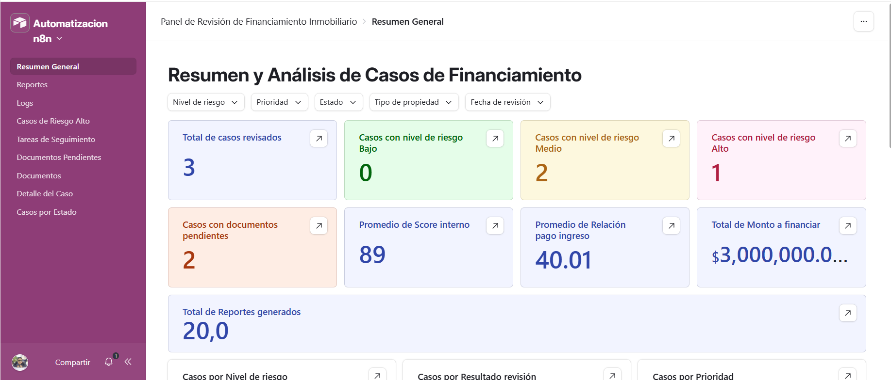
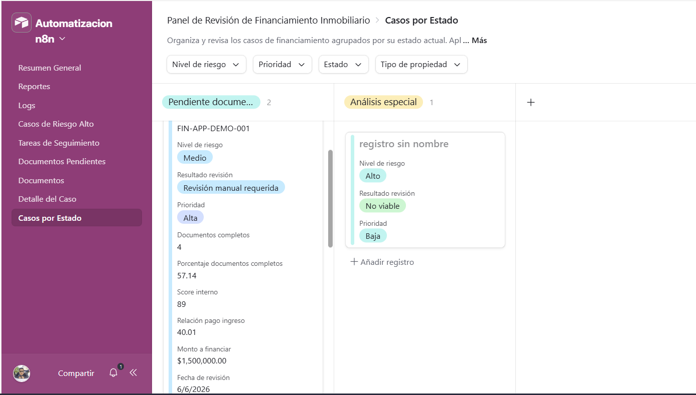
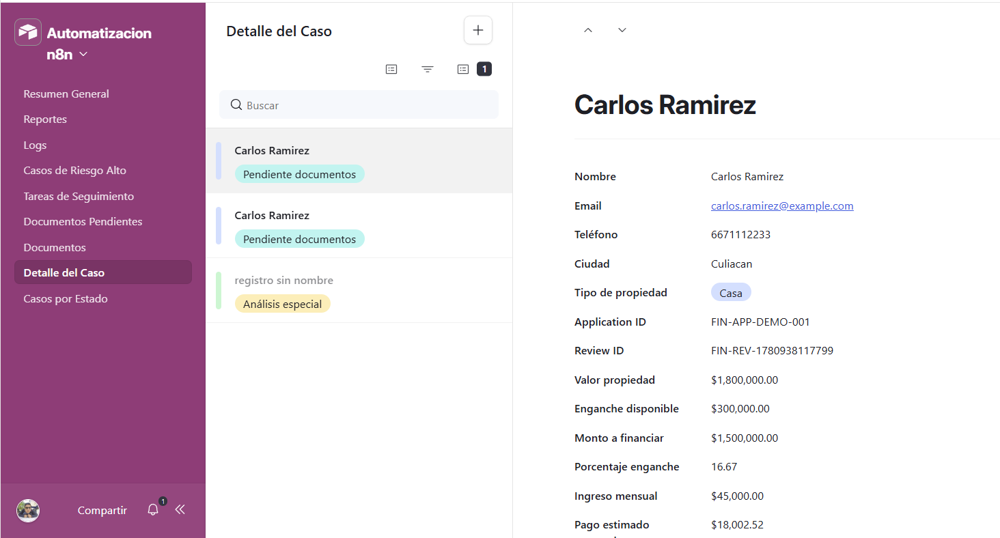
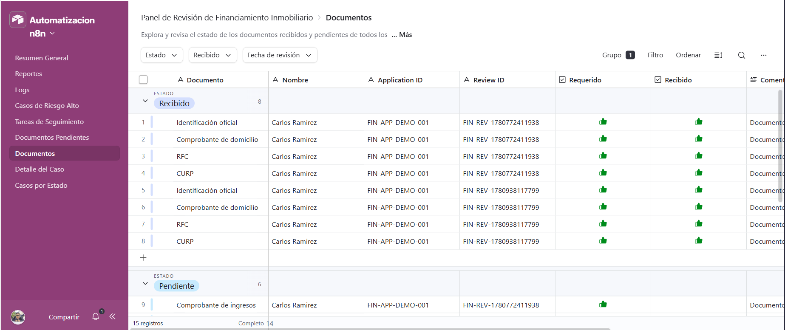
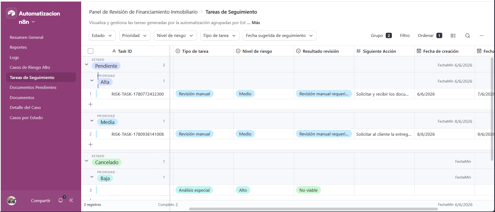
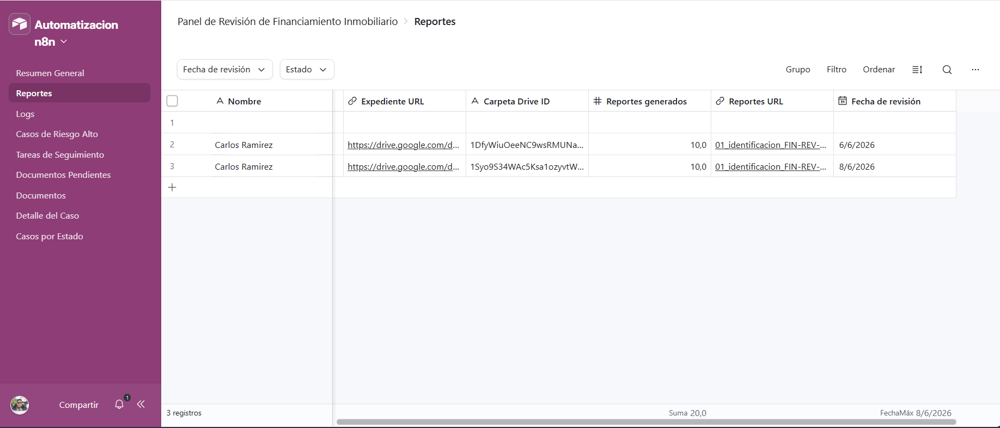
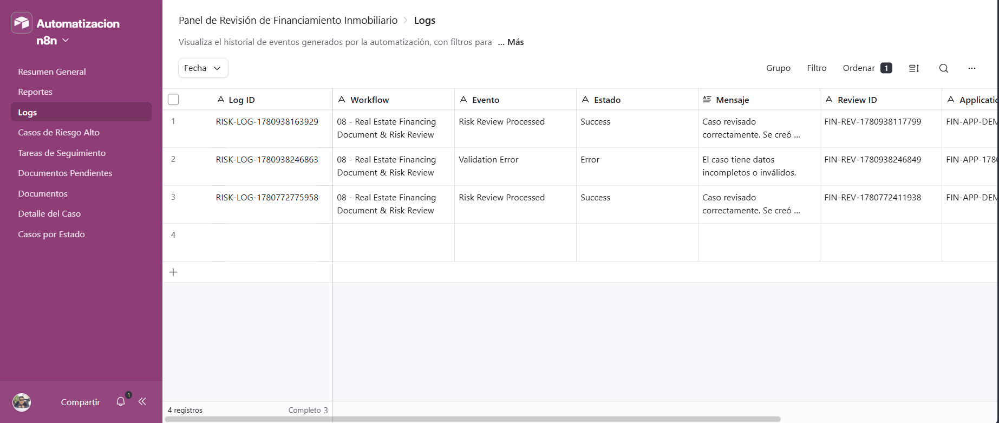

[English](./README.md) | [Español](./README.es.md)

# 08 - Real Estate Financing Document & Risk Review Workflow

## Objective

Build an advanced n8n automation for a real estate financing company that receives a financing case, validates applicant data, creates a Google Drive folder structure, evaluates a document checklist, calculates financial risk metrics, analyzes the case with OpenAI, creates review tasks, generates Word-compatible and Excel-compatible reports, stores automation logs, supports an Airtable dashboard and returns a structured JSON response.

## Business Problem

Real estate financing companies often need to review applicant information, financial capacity, property data, documentation status and internal risk before continuing with a financing process.

Manual review can be slow, inconsistent and difficult to audit. Teams may need to check missing documents, calculate basic ratios, assign follow-up tasks, create folders, generate internal summaries, review reports and maintain logs across different tools.

## Solution

This workflow receives a financing review case through a webhook. It normalizes and validates the input, searches for an existing case in Airtable, creates a structured Google Drive folder, generates subfolders by document category, evaluates a document checklist, stores each checklist item in Airtable, calculates financial risk metrics, uses OpenAI to analyze the case, generates internal reports, registers the review in Airtable, creates a follow-up task, logs the automation event and returns a complete response.

The project also includes an Airtable interface to visualize financing cases, document status, follow-up tasks, generated reports and automation logs.

## Tools Used

* n8n
* Airtable
* Airtable REST API
* Airtable Interface
* Google Drive
* OpenAI API
* Webhook
* HTTP Request nodes
* JavaScript Code node
* JSON
* Google OAuth2
* Token-based authentication
* Prompt engineering
* AI-powered risk analysis
* Document checklist automation
* Word-compatible report generation
* Excel-compatible report generation
* Automation logs
* Operational dashboard design

## Workflow Logic

```text
Webhook - Receive Financing Case
↓
Normalize Data
↓
Validate Applicant Data
↓
Is Data Valid?
├── False → Create Validation Error Log
│            ↓
│         Return Validation Error
│
└── True  → Search Existing Review in Airtable
              ↓
           Does Review Exist?
           ├── True  → Mark Existing Review
           └── False → Mark New Review
              ↓
           Create Main Google Drive Folder
              ↓
           Create Subfolder 01 - Identificacion
              ↓
           Create Subfolder 02 - Ingresos
              ↓
           Create Subfolder 03 - Estados de Cuenta
              ↓
           Create Subfolder 04 - Documentos de Propiedad
              ↓
           Create Subfolder 05 - Revision Interna
              ↓
           Evaluate Document Checklist
              ↓
           Register Checklist Documents in Airtable
              ↓
           Calculate Financial Score
              ↓
           Analyze Risk with OpenAI
              ↓
           Parse AI Response
              ↓
           Generate Internal Summary
              ↓
           Generate Word and Excel Compatible Reports
              ↓
           Save Reports in Google Drive
              ↓
           Register Case Review in Airtable
              ↓
           Create Risk Review Task
              ↓
           Create Success Log
              ↓
           Return Final Result
```

## Airtable Tables Used

### Financing Case Reviews

Stores the main case review, applicant information, financial metrics, document summary, AI analysis, generated reports and final review status.

Main fields:

* Review ID
* Application ID
* Nombre
* Email
* Teléfono
* Ciudad
* Tipo de propiedad
* Valor propiedad
* Enganche disponible
* Monto a financiar
* Porcentaje enganche
* Ingreso mensual
* Pago estimado mensual
* Relación pago ingreso
* Antigüedad laboral años
* Score crediticio
* Documentos completos
* Documentos faltantes
* Porcentaje documentos completos
* Score interno
* Nivel de riesgo
* Resultado revisión
* Prioridad
* Resumen IA
* Siguiente Acción
* Estado
* Expediente URL
* Carpeta Drive ID
* Reportes generados
* Reportes URL
* Fecha de revisión
* JSON Original
* AI Raw Response

### Document Checklist

Stores each required document as an individual checklist record.

Main fields:

* Checklist ID
* Review ID
* Application ID
* Nombre
* Documento
* Requerido
* Recibido
* Estado
* Comentario
* Fecha de revisión

### Risk Review Tasks

Stores follow-up tasks generated according to risk level, review result and missing information.

Main fields:

* Task ID
* Review ID
* Application ID
* Nombre
* Tipo de tarea
* Prioridad
* Nivel de riesgo
* Resultado revisión
* Siguiente Acción
* Estado
* Fecha de creación
* Fecha sugerida de seguimiento

### Risk Automation Logs

Stores workflow execution events for traceability and auditing.

Main fields:

* Log ID
* Workflow
* Evento
* Estado
* Mensaje
* Review ID
* Application ID
* Fecha
* JSON

## Input Example

```json
{
  "application_id": "FIN-APP-DEMO-001",
  "nombre": "Carlos Ramirez",
  "email": "carlos.ramirez@example.com",
  "telefono": "6671112233",
  "ciudad": "Culiacan",
  "tipo_propiedad": "Casa",
  "valor_propiedad": 1800000,
  "enganche_disponible": 300000,
  "ingreso_mensual": 45000,
  "plazo_deseado_anios": 15,
  "antiguedad_laboral_anios": 3,
  "score_crediticio": 690,
  "documentos": {
    "identificacion_oficial": true,
    "comprobante_domicilio": true,
    "comprobante_ingresos": false,
    "estados_cuenta": false,
    "rfc": true,
    "curp": true,
    "documentos_propiedad": false
  },
  "mensaje": "El cliente quiere avanzar con la revisión de financiamiento y tiene algunos documentos pendientes."
}
```

## Successful Response

```json
{
  "success": true,
  "message": "Caso de financiamiento revisado correctamente.",
  "review_id": "FIN-REV-1780769999999",
  "application_id": "FIN-APP-DEMO-001",
  "nombre": "Carlos Ramirez",
  "monto_financiar": 1500000,
  "porcentaje_enganche": 16.67,
  "pago_estimado_mensual": 18002.52,
  "relacion_pago_ingreso": 40.01,
  "documentos_completos": 4,
  "documentos_faltantes": [
    "Comprobante de ingresos",
    "Estados de cuenta",
    "Documentos de propiedad"
  ],
  "porcentaje_documentos_completos": 57.14,
  "score_interno": 72,
  "nivel_riesgo": "Medio",
  "resultado_revision": "Revisión manual requerida",
  "prioridad": "Alta",
  "siguiente_accion": "Solicitar documentos faltantes y validar capacidad de pago.",
  "expediente_url": "https://drive.google.com/drive/folders/DRIVE_FOLDER_ID",
  "checklist_created": true,
  "internal_summary_created": true,
  "report_files_created": true,
  "report_files_count": 10,
  "word_reports_count": 5,
  "excel_reports_count": 5,
  "task_created": true,
  "log_created": true,
  "note": "Esta revisión automatizada es demostrativa y no representa una aprobación crediticia final."
}
```

## Validation Error Response

```json
{
  "success": false,
  "message": "El caso tiene datos incompletos o inválidos.",
  "errores": [
    "Nombre inválido o vacío",
    "Email inválido o vacío",
    "Teléfono inválido o vacío",
    "Ciudad inválida o vacía",
    "Valor de propiedad inválido",
    "Ingreso mensual inválido",
    "Plazo deseado inválido",
    "Score crediticio fuera de rango",
    "Mensaje inválido o vacío"
  ],
  "log_created": true
}
```

## Generated Google Drive Structure

```text
Risk Review Folder/
└── FINANCING_REVIEW_FIN-REV-1780769999999_Carlos Ramirez/
    ├── 01 - Identificacion/
    │   ├── 01_identificacion_FIN-REV-1780769999999.doc
    │   └── 01_identificacion_FIN-REV-1780769999999.csv
    ├── 02 - Ingresos/
    │   ├── 02_ingresos_FIN-REV-1780769999999.doc
    │   └── 02_ingresos_FIN-REV-1780769999999.csv
    ├── 03 - Estados de Cuenta/
    │   ├── 03_estados_cuenta_FIN-REV-1780769999999.doc
    │   └── 03_estados_cuenta_FIN-REV-1780769999999.csv
    ├── 04 - Documentos de Propiedad/
    │   ├── 04_propiedad_FIN-REV-1780769999999.doc
    │   └── 04_propiedad_FIN-REV-1780769999999.csv
    └── 05 - Revision Interna/
        ├── 05_revision_interna_FIN-REV-1780769999999.doc
        └── 05_revision_interna_FIN-REV-1780769999999.csv
```

## Reports Generated

The workflow generates Word-compatible and Excel-compatible files for each folder.

| Folder                       | Word-compatible report | Excel-compatible report |
| ---------------------------- | ---------------------- | ----------------------- |
| 01 - Identificacion          | .doc                   | .csv                    |
| 02 - Ingresos                | .doc                   | .csv                    |
| 03 - Estados de Cuenta       | .doc                   | .csv                    |
| 04 - Documentos de Propiedad | .doc                   | .csv                    |
| 05 - Revision Interna        | .doc                   | .csv                    |

The `.doc` files are Word-compatible text documents.
The `.csv` files are Excel-compatible spreadsheets.

## Financial Metrics Calculated

* Financing amount
* Down payment percentage
* Estimated monthly payment
* Payment-to-income ratio
* Completed document percentage
* Internal score
* Risk level
* Review result
* Follow-up priority

## Airtable Dashboard

In addition to the n8n workflow, this project includes an Airtable interface to visualize the information generated by the automation.

The dashboard allows users to review financing cases, pending documents, follow-up tasks, generated reports and automation logs from an organized internal operations view.

### Dashboard Pages

The Airtable dashboard includes the following pages:

* General Summary
* Cases by Status
* Case Detail
* Documents
* Pending Documents
* Follow-Up Tasks
* High Risk Cases
* Logs
* Reports

### Data Sources

The dashboard uses data from the following Airtable tables:

* Financing Case Reviews
* Document Checklist
* Risk Review Tasks
* Risk Automation Logs

### Dashboard Features

* General overview of reviewed financing cases.
* Case count by risk level.
* Review of received and pending documents.
* Follow-up task tracking.
* Access to generated Google Drive reports.
* Automation log review.
* Filters by risk level, priority, status, property type and review date.
* Detailed case review using Review ID and Application ID.

### Dashboard Value

The Airtable dashboard makes the data generated by n8n easier to review. Instead of only working with raw tables, users can analyze case status, check pending documents, review tasks and access generated reports from a more organized interface.

This component complements the main workflow by turning automated data into a visual operational tracking tool.

## Screenshots

### Complete n8n workflow


### Successful response


### Validation error response


### Financing case review record


### Document checklist records


### Risk review task record


### Risk automation log record


### Google Drive folder structure


### Generated Word-compatible reports


### Generated Excel-compatible reports


### Airtable dashboard summary



### Airtable cases by status



### Airtable case detail



### Airtable document checklist



### Airtable follow-up tasks



### Airtable reports view



### Airtable automation logs



## Business Value

* Automates financing case review intake.
* Validates applicant and financial data.
* Creates a structured Google Drive folder system.
* Evaluates required documents automatically.
* Registers each checklist item in Airtable.
* Calculates internal financial risk metrics.
* Uses AI to summarize the case and suggest next actions.
* Generates Word-compatible and Excel-compatible reports.
* Creates operational follow-up tasks.
* Stores logs for traceability and auditing.
* Provides an Airtable dashboard for case review, document tracking, report access and task follow-up.
* Provides a complex back-office automation aligned with real estate financing operations.

## Disclaimer

This workflow performs a basic automated review for demonstration purposes only. It does not represent final credit approval, legal advice or financial recommendation.

## Security Note

The exported workflow must not include real API tokens, OpenAI API keys, Airtable personal access tokens, Google credentials, folder IDs or private identifiers.

Before publishing the workflow, replace credentials and private IDs with placeholders such as:

```text
Bearer AIRTABLE_TOKEN_HERE
Bearer OPENAI_API_KEY_HERE
AIRTABLE_BASE_ID_HERE
RISK_REVIEW_FOLDER_ID_HERE
GOOGLE_DRIVE_CREDENTIAL_PLACEHOLDER
```

Never commit real credentials to a public repository.
